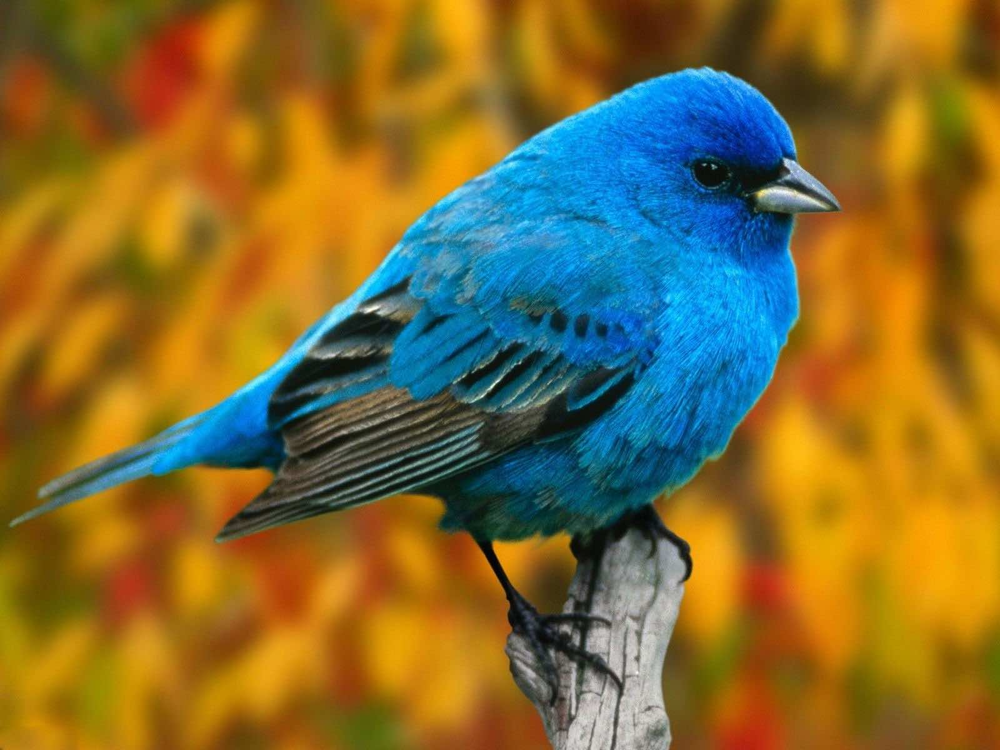

# Ascii Image Art Generator
- Converts an image to a collection of ascii characters (Different characters correspond to different brightness)

## Examples
### Before:

### After:

### Before:

### After:

### Before:

### After:

### Before:

### After:

